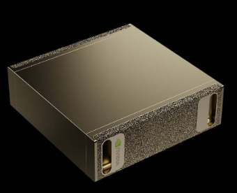
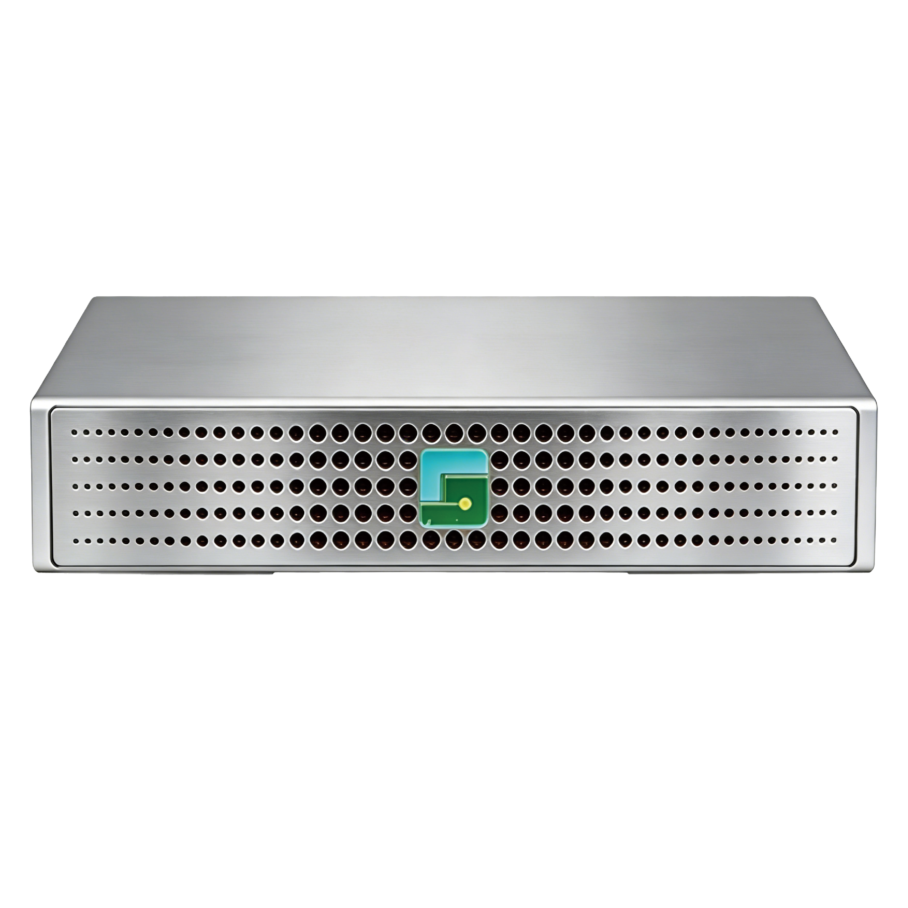

# SparkEdgeSim

**Interface-compatible, parameterized, hardware-aware edge compute unit simulator for DGX Spark & GP Spark.**

> **Disclaimer**: SparkEdgeSim is a *parameterized simulation/emulation platform* designed for distributed systems research. It is **not** a one-to-one official hardware replica of NVIDIA DGX Spark or GP Spark. All hardware parameters are derived from publicly available specifications and are configurable for research purposes.

---

## Overview

SparkEdgeSim models a single edge compute unit combining:

- **1 × NVIDIA DGX Spark** — GPU/CPU compute, neural network inference, micro-batch processing
- **1 × GP Spark** — High-speed NVMe-oF storage with RDMA offload
- **Edge network interface** — Configurable edge-edge and edge-cloud communication

The simulator exposes a stable REST API and Python SDK, enabling seamless integration with orchestration frameworks like [SkyGrid](https://github.com/your-org/SkyGrid) or any custom edge computing platform.

## Architecture

```
┌─────────────────────────────────────────────────────────────────┐
│                        EdgeUnitNode                             │
│  ┌───────────────┐  ┌──────────────┐  ┌──────────────────────┐ │
│  │  DGX Spark    │  │  GP Spark    │  │   Network Model      │ │
│  │  ComputeModel │  │  StorageModel│  │  (edge↔edge/cloud)   │ │
│  │               │  │              │  │                      │ │
│  │  • GPU TFLOPS │  │  • NVMe-oF   │  │  • RTT / bandwidth   │ │
│  │  • Batch curve│  │  • RDMA/GDS  │  │  • Jitter / congest. │ │
│  │  • Memory     │  │  • IOPS/lat  │  │  • Multi-link topo   │ │
│  └───────┬───────┘  └──────┬───────┘  └──────────┬───────────┘ │
│          │                 │                     │              │
│  ┌───────▼─────────────────▼─────────────────────▼───────────┐ │
│  │                    Scheduler                               │ │
│  │  FIFO / Priority / EDF • micro-batch • backpressure        │ │
│  └───────────────────────────┬───────────────────────────────┘ │
│                              │                                  │
│  ┌───────────────────────────▼───────────────────────────────┐ │
│  │                    State Store                             │ │
│  │  Hot (memory) → Warm (GP Spark) → Cold (remote fallback)  │ │
│  │  • audit log • snapshot / replay • neighbour lookup        │ │
│  └───────────────────────────────────────────────────────────┘ │
│                                                                 │
│  ┌─────────────────┐  ┌──────────────────┐  ┌───────────────┐ │
│  │   Telemetry     │  │  Sim Engine      │  │  Workloads    │ │
│  │  p50/p95/p99    │  │  Discrete-event  │  │  Pluggable    │ │
│  │  throughput     │  │  timeline        │  │  generators   │ │
│  └─────────────────┘  └──────────────────┘  └───────────────┘ │
├─────────────────────────────────────────────────────────────────┤
│                    REST API (FastAPI)                            │
│  POST /submit_task • /submit_batch • /fetch_state • /metrics    │
├─────────────────────────────────────────────────────────────────┤
│                    Python SDK + CLI                              │
│  EdgeUnitClient • edge-unit-sim serve|benchmark|run-example     │
└─────────────────────────────────────────────────────────────────┘
```

---

## Hardware Reference

### NVIDIA DGX Spark

The NVIDIA DGX Spark is based on the Grace Blackwell architecture, designed to bring petaflop-class AI computing to a desktop form factor.

<p align="center">
  
</p>

| Specification | Value |
|---|---|
| Architecture | NVIDIA Grace Blackwell |
| GPU | NVIDIA Blackwell Architecture |
| CPU | 20-core Arm (10× Cortex-X925 + 10× Cortex-A725) |
| Tensor Performance | ~1 PFLOP (FP8/FP4) |
| System Memory | 128 GB LPDDR5x, coherent unified memory |
| Memory Bandwidth | Up to 273 GB/s |
| Storage | 4 TB NVMe M.2 with self-encryption |
| NIC | ConnectX-7 @ 200 Gbps |
| Ethernet | 1× RJ-45 10 GbE |
| Wi-Fi | Wi-Fi 7 |
| Power | 240 W |
| Dimensions | 150 mm × 150 mm × 50.5 mm |
| Weight | 1.2 kg |
| OS | NVIDIA DGX OS |

### GP Spark

GP Spark is a data center-grade NVMe-oF storage node that integrates RDMA (RoCEv2) and NVMe-oF protocol stacks into a dedicated hardware offload engine for end-to-end data acceleration.

<p align="center">
  
</p>

| Specification | Value |
|---|---|
| Drive Support | Up to 4× NVMe SSDs (M.2 2280/22110) |
| Capacity per Drive | 0.96 TB – 8 TB+ |
| Transmission Bandwidth | 100 Gb/s |
| Throughput | 11.6 GB/s |
| IOPS | 2.7 Million |
| Access Latency | < 20 µs |
| Interconnectivity | 100 GbE, 2×50 GbE, RDMA |
| Protocols | NVMe-oF, GDS (GPUDirect Storage) |
| Power | < 100 W |
| Dimensions | 150 mm × 150 mm × 33 mm |
| Compatibility | DGX Spark, DGX Station, compute servers |

### Combined Edge Unit

A DGX Spark + GP Spark pair creates a self-contained edge compute unit:

- **Compute**: ~1 PFLOP tensor, 20-core Arm CPU, 128 GB unified memory
- **Storage**: Up to 32 TB NVMe-oF, 2.7M IOPS, < 20 µs latency, RDMA/GDS
- **Network**: 200 Gbps ConnectX-7 + 100 GbE storage network
- **Form factor**: Two desktop-sized units (~150 mm cube each), < 340 W combined
- **Use case**: Edge AI inference, UAM control, real-time spatial computing

---

## Installation

```bash
# Clone the repository
git clone https://github.com/your-org/SparkEdgeSim.git
cd SparkEdgeSim

# Install in development mode
pip install -e ".[dev]"
```

## Quick Start

### Start the Simulator Server

```bash
# With default configuration
edge-unit-sim serve

# With a custom profile
edge-unit-sim serve --config configs/edge_unit_default.yaml --port 8080
```

### Run Built-in Examples

```bash
edge-unit-sim run-example single_task
edge-unit-sim run-example batch
```

### Run a Throughput Benchmark

```bash
edge-unit-sim benchmark --tasks 10000 --batch-size 16
```

### Python SDK Usage

```python
from dgx_gp_spark_sim import EdgeUnitClient, Task, BatchRequest

client = EdgeUnitClient("http://localhost:8080")

# Submit a single task
task = Task(
    task_id="t-001",
    op_type="risk_score",
    flops=1.2e8,
    input_bytes=4096,
    state_refs=["cell_12", "neighbor_window_12"],
    priority=1,
)

resp = client.submit_task(task)
print(resp.latency_ms, resp.queue_delay_ms, resp.state_hit_ratio)

# Submit a batch
batch = BatchRequest(
    batch_id="b-001",
    tasks=[Task(task_id=f"t-{i}", flops=5e7) for i in range(16)],
)
batch_resp = client.submit_batch(batch)
```

### Direct Python Usage (No Server)

```python
import asyncio
from dgx_gp_spark_sim.edge_unit.node import EdgeUnitNode
from dgx_gp_spark_sim.models import Task

async def main():
    node = EdgeUnitNode()
    task = Task(task_id="t-001", flops=1e8, state_refs=["cell_0"])
    result = await node.submit_task(task)
    print(f"Latency: {result.latency_ms:.3f} ms")

asyncio.run(main())
```

---

## API Reference

### REST Endpoints

| Method | Path | Description |
|---|---|---|
| `POST` | `/submit_task` | Submit a single compute task |
| `POST` | `/submit_batch` | Submit a micro-batch of tasks |
| `POST` | `/fetch_state` | Query local state store |
| `POST` | `/persist_audit` | Write state with audit logging |
| `POST` | `/control/reconfigure` | Dynamically reconfigure parameters |
| `GET` | `/metrics` | Export telemetry metrics |
| `GET` | `/health` | Health check |
| `GET` | `/profile` | Current hardware/system profile |

### Metrics Output

The `/metrics` endpoint returns:

- `throughput_tps` — Tasks completed per second
- `latency.p50_ms / p95_ms / p99_ms` — Latency percentiles
- `queue_length` — Current scheduler queue depth
- `compute_utilization` — GPU utilization fraction
- `storage_utilization` — Storage utilization fraction
- `network_bytes_total` — Total bytes transferred
- `state_hit_ratio` — Hot+warm hit ratio
- `batch_size_distribution` — Batch size percentiles
- `tasks_dropped / tasks_delayed` — Overflow counts

---

## Configuration

All hardware and system parameters are driven by YAML configuration files. Unspecified fields fall back to sensible defaults.

### Provided Profiles

| Profile | Description |
|---|---|
| `edge_unit_default.yaml` | Standard DGX Spark + GP Spark configuration |
| `edge_unit_high_density.yaml` | Dense UAM deployment: large queues, aggressive batching |
| `edge_unit_lightweight.yaml` | Resource-constrained: single SSD, smaller caches |
| `dgx_spark_default.yaml` | DGX Spark hardware profile only |
| `gp_spark_default.yaml` | GP Spark hardware profile only |

### Key Configuration Parameters

<details>
<summary>DGX Spark</summary>

```yaml
dgx_spark:
  gpu_tflops: 1000.0
  cpu_cores: 20
  unified_memory_gb: 128.0
  memory_bandwidth_gbps: 273.0
  nvme_capacity_tb: 4.0
  nic_bandwidth_gbps: 200.0
  max_concurrent_batches: 8
  batch_curve_points: [[1, 1.0], [4, 0.85], [8, 0.75], [16, 0.65], [32, 0.55]]
  power_watts: 240.0
```
</details>

<details>
<summary>GP Spark</summary>

```yaml
gp_spark:
  max_ssd_count: 4
  storage_bandwidth_gbps: 11.6
  iops: 2700000
  read_latency_us: 20.0
  write_latency_us: 25.0
  rdma_enabled: true
  gds_enabled: true
  nvmeof_enabled: true
  power_watts: 100.0
```
</details>

<details>
<summary>Network</summary>

```yaml
network:
  edge_edge_rtt_ms: 2.0
  edge_cloud_rtt_ms: 20.0
  bandwidth_gbps: 10.0
  jitter_ms: 0.5
  congestion_factor: 1.0
```
</details>

<details>
<summary>Edge Unit</summary>

```yaml
unit_id: "edge-unit-0"
scheduler_policy: "fifo"       # fifo | priority | edf
queue_capacity: 1024
microbatch_max: 16
microbatch_timeout_ms: 10.0
local_cache_capacity: 10000
warm_state_capacity: 100000
failure_rate: 0.0
recovery_time_ms: 500.0
```
</details>

---

## SkyGrid Integration

SparkEdgeSim is designed to work as the edge unit backend for SkyGrid and similar orchestration systems. The `SkyGridAdapter` provides three operating modes:

### Mode 1: Live Edge Unit
SkyGrid treats the simulator as a real edge unit — submitting operator batches, querying state, and receiving metrics.

### Mode 2: Performance Oracle
Given task characteristics and data placement, the adapter returns predicted latency breakdowns without actually executing — useful for placement optimization.

### Mode 3: Discrete-Event Backend
SkyGrid manages global time advancement; the adapter only simulates internal unit behavior within each time step.

```python
from dgx_gp_spark_sim.integrations import SkyGridAdapter

adapter = SkyGridAdapter(mode="oracle")
breakdown = adapter.predict_latency(
    flops=2e8, input_bytes=4096,
    state_refs=["cell_12"], data_local=True,
)
print(f"Predicted: {breakdown.total_ms:.3f} ms")
```

See `examples/skygrid_style.py` for a complete demonstration.

---

## Comparison with Real Hardware

| Aspect | SparkEdgeSim | Real DGX Spark + GP Spark |
|---|---|---|
| Compute latency | Parameterized model (FLOPS-based) | Actual GPU kernel execution |
| Storage access | Latency/IOPS model with jitter | Physical NVMe-oF with RDMA |
| Network | Configurable RTT + bandwidth model | Real network stack |
| Failures | Stochastic injection | Hardware faults |
| Batching | Efficiency curve interpolation | CUDA stream scheduling |
| State management | Tiered LRU simulation | OS/driver page management |

SparkEdgeSim is calibrated to match the *order of magnitude* and *relative relationships* of real hardware performance, but individual measurements should not be treated as ground-truth hardware benchmarks.

---

## Project Structure

```
SparkEdgeSim/
├── src/dgx_gp_spark_sim/
│   ├── edge_unit/          # DGX Spark compute + GP Spark storage
│   │   ├── compute.py      # DGXSparkComputeModel
│   │   ├── storage.py      # GPSparkStorageModel
│   │   └── node.py         # EdgeUnitNode (unified façade)
│   ├── network/            # Network latency & topology model
│   ├── scheduler/          # FIFO/priority/EDF + micro-batch
│   ├── state/              # Hot/warm/cold tiered state store
│   ├── sim/                # Discrete-event simulation engine
│   ├── api/                # FastAPI REST server
│   ├── telemetry/          # Metrics collection & export
│   ├── workloads/          # Pluggable workload generators
│   ├── integrations/       # SkyGrid adapter
│   ├── client.py           # Python SDK (sync + async)
│   ├── cli.py              # CLI (edge-unit-sim)
│   ├── config.py           # Pydantic configuration models
│   └── models.py           # Core data models
├── configs/                # YAML hardware profiles
├── tests/                  # pytest test suite
├── examples/               # Runnable example scripts
└── docs/                   # Documentation
```

---

## Testing

```bash
# Run all tests
pytest

# With coverage
pytest --cov=dgx_gp_spark_sim --cov-report=html

# Run specific test module
pytest tests/test_compute.py -v
```

---

## Roadmap

- [ ] gRPC API implementation
- [ ] Prometheus metrics exporter
- [ ] Multi-unit topology simulation engine
- [ ] Replay mode (trace playback)
- [ ] Docker image + docker-compose
- [ ] Trace export to JSON/CSV/Parquet
- [ ] Interactive terminal dashboard (textual)
- [ ] Rust acceleration for hot paths
- [ ] Formal validation against hardware benchmarks

---

## License

Apache License 2.0 — see [LICENSE](LICENSE).

---

## Citation

If you use SparkEdgeSim in your research, please cite:

```bibtex
@software{sparkedgesim2024,
  title={SparkEdgeSim: Hardware-Aware Edge Compute Unit Simulator},
  author={SparkEdgeSim Contributors},
  year={2024},
  url={https://github.com/your-org/SparkEdgeSim}
}
```
